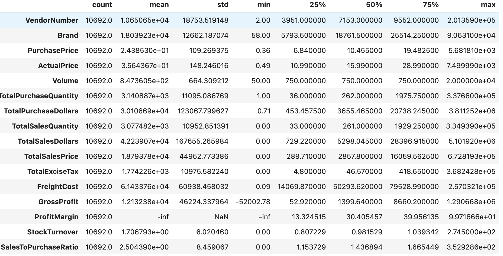
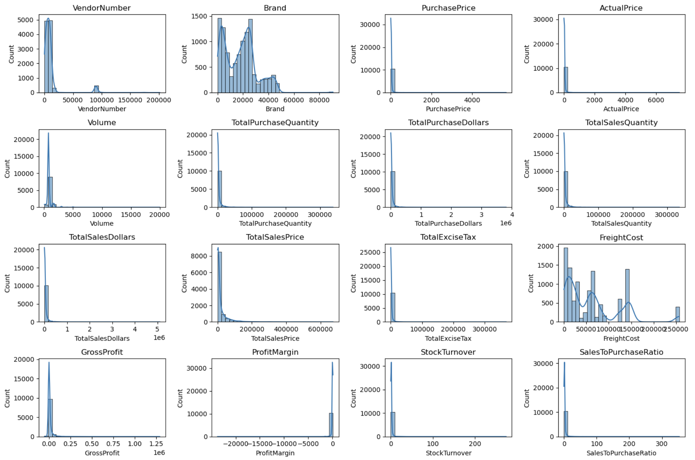
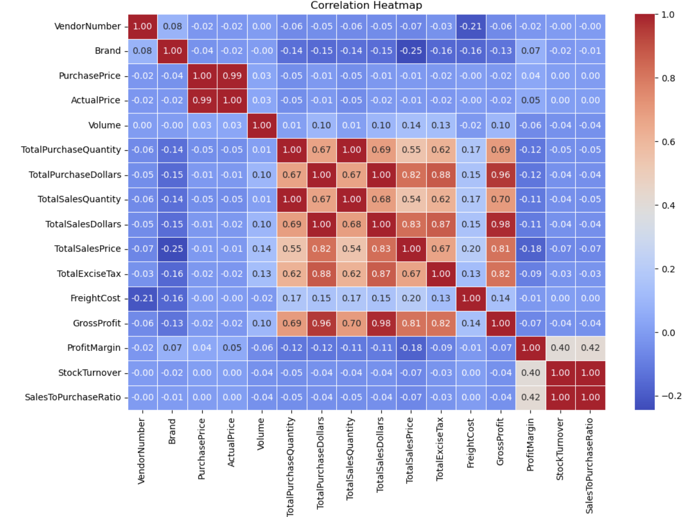
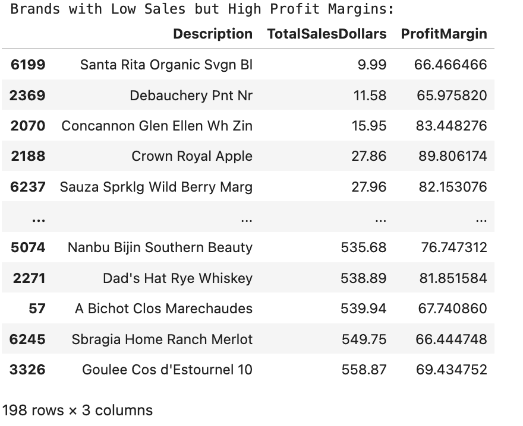
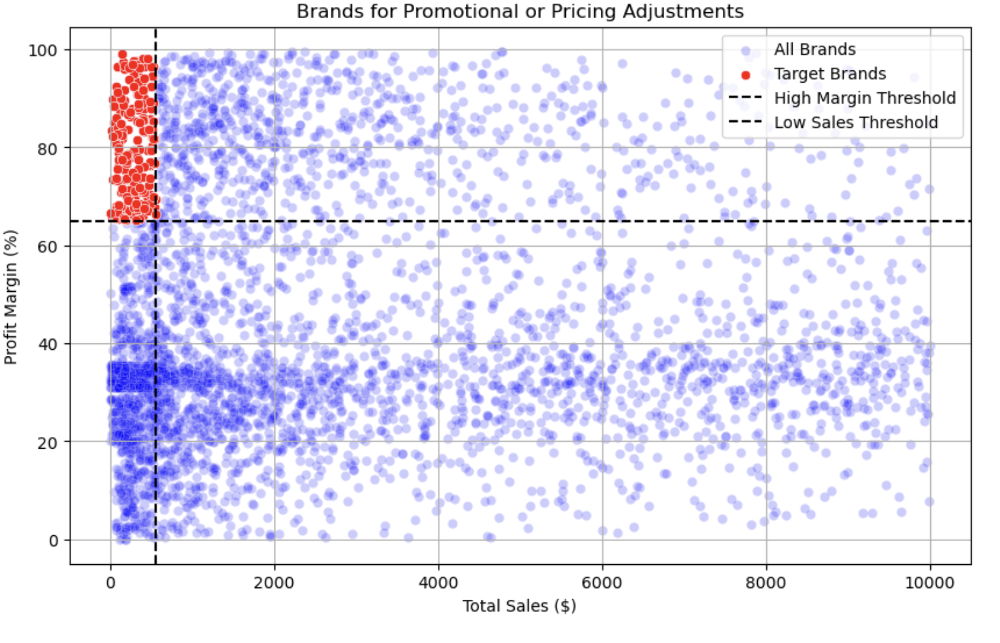
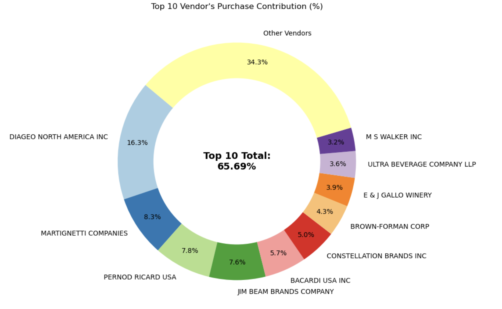
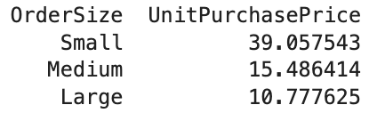
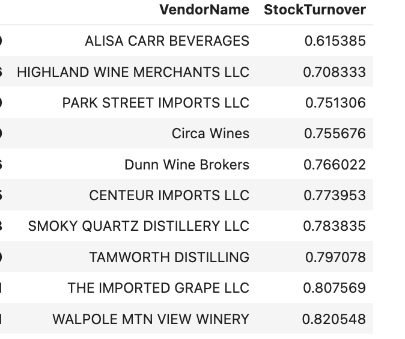
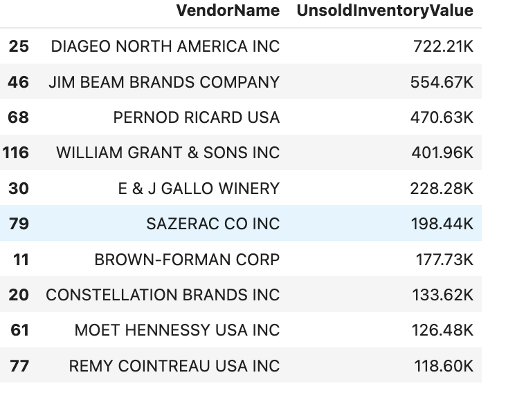
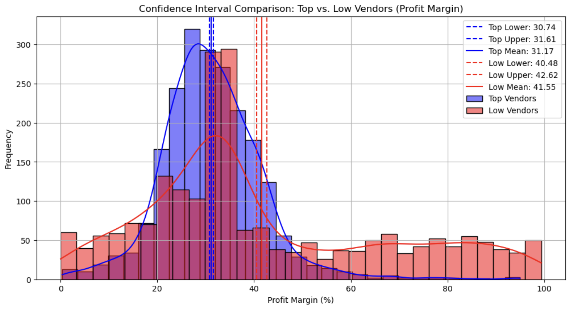

# 📊 Vendor Performance Analysis Report

> Inventory, sales, and vendor analytics for the retail & wholesale industry.

---

## 📌 Table of Contents

- [Business Problem](#-business-problem)
- [Exploratory Data Analysis](#-exploratory-data-analysis)
- [Data Filtering](#-data-filtering)
- [Correlation Insights](#-correlation-insights)
- [Research Questions & Key Findings](#-research-questions--key-findings)
- [Final Recommendations](#-final-recommendations)

---

## 🎯 Business Problem

Effective inventory and sales management are critical for optimizing profitability in the retail and wholesale industry. Companies need to ensure that they are not incurring losses due to inefficient pricing, poor inventory turnover, or vendor dependency.

The goals of this analysis are to:

- Identify underperforming brands that require promotional or pricing adjustments.
- Determine top vendors contributing to sales and gross profit.
- Analyze the impact of bulk purchasing on unit costs.
- Assess inventory turnover to reduce holding costs and improve efficiency.
- Investigate the profitability variance between high-performing and low-performing vendors.

---

## 🔍 Exploratory Data Analysis

### Summary Statistics

  

### Feature Distributions

  

### Negative & Zero Values

| Metric | Observation |
|---|---|
| **Gross Profit** | Minimum of **-52,002.78**, indicating potential losses due to high costs or heavy discounts — possibly products sold below purchase cost. |
| **Profit Margin** | Minimum of **-∞**, suggesting instances where revenue is zero or lower than total cost, leading to extreme negative margins. |
| **Total Sales Quantity & Sales Dollars** | Some products show **zero sales**, meaning they were purchased but never sold — potentially slow-moving or obsolete stock. |

### Outliers Detected by High Standard Deviations

| Metric | Observation |
|---|---|
| **Purchase & Actual Prices** | Max values (**5,681.81** & **7,499.99**) are far above the means (**24.39** & **35.64**), indicating premium product offerings. |
| **Freight Cost** | Extreme variation from **0.09** to **257,032.07**, suggesting logistics inefficiencies, bulk shipments, or erratic shipping costs. |
| **Stock Turnover** | Ranges from **0** to **274.5**. Some products sell rapidly while others remain unsold. A value > 1 means sales exceeded purchased quantity, due to older stock fulfilling orders. |

---

## 🧹 Data Filtering

To enhance the reliability of insights, inconsistent data points were removed where:

- **Gross Profit ≤ 0** — excludes transactions leading to losses.
- **Profit Margin ≤ 0** — ensures focus on profitable transactions.
- **Total Sales Quantity = 0** — eliminates inventory that was never sold.

---

## 🔗 Correlation Insights

  

- **Purchase Price vs. Total Sales Dollars & Gross Profit:** Weak correlation (-0.012 and -0.016) — price variations do not significantly impact sales revenue or profit.
- **Total Purchase Quantity vs. Total Sales Quantity:** Strong correlation (0.999), confirming efficient inventory turnover.
- **Profit Margin vs. Total Sales Price:** Negative correlation (-0.179) — higher sales prices may reduce margins, possibly due to competitive pricing pressures.
- **Stock Turnover vs. Gross Profit & Profit Margin:** Weak negative correlation (-0.038 & -0.055) — faster turnover does not necessarily mean higher profitability.

---

## 🧠 Research Questions & Key Findings

### 1. Brands for Promotional or Pricing Adjustments

Brands with low sales but high profit margins:

  

**198 brands** exhibit lower sales but higher profit margins. These could benefit from targeted marketing, promotions, or price optimization to increase volume without compromising profitability.

  

---

### 2. Top Vendors by Sales & Purchase Contribution

The **top 10 vendors contribute 65.69%** of total purchases, while the remaining vendors contribute only **34.31%**. This over-reliance on a few vendors may introduce risks such as supply chain disruptions, indicating a need for diversification.

  

---

### 3. Impact of Bulk Purchasing on Cost Savings

Vendors buying in large quantities receive a **72% lower unit cost** ($10.78 per unit vs. higher unit costs in smaller orders). Bulk pricing strategies encourage larger orders, increasing total sales while maintaining profitability.

  

| Order Size | Unit Purchase Price |
|---|---|
| Small | $39.06 |
| Medium | $15.49 |
| Large | $10.78 |

---

### 4. Identifying Vendors with Low Inventory Turnover

**Total Unsold Inventory Capital: $2.71M**

Slow-moving inventory increases storage costs, reduces cash flow efficiency, and affects overall profitability. Identifying vendors with low inventory turnover enables better stock management and minimizes financial strain.

**Vendors with lowest stock turnover**

  

**Vendors with highest unsold inventory value**

  

---

### 5. Profit Margin Comparison: High vs. Low-Performing Vendors

| Group | 95% CI | Mean |
|---|---|---|
| **Top Vendors** | (30.74%, 31.61%) | 31.17% |
| **Low Vendors** | (40.48%, 42.62%) | 41.55% |

Low-performing vendors maintain higher margins but struggle with sales volumes, indicating potential pricing inefficiencies or market reach issues.

**Actionable insights**

- **Top-performing vendors:** Optimize profitability by adjusting pricing, reducing operational costs, or offering bundled promotions.
- **Low-performing vendors:** Improve marketing efforts, optimize pricing strategies, and enhance distribution networks.

  

---

### 6. Statistical Validation of Profit Margin Differences

**Hypothesis Testing**

- **H₀ (Null):** No significant difference in profit margins between top and low-performing vendors.
- **H₁ (Alternative):** A significant difference exists in profit margins between the two vendor groups.

**Result:** The null hypothesis is **rejected**, confirming that the two groups operate under distinctly different profitability models.

**Implication:** High-margin vendors may benefit from better pricing strategies, while top-selling vendors could focus on cost efficiency.

---

## ✅ Final Recommendations

1. **Re-evaluate pricing** for low-sales, high-margin brands to boost sales volume without sacrificing profitability.
2. **Diversify vendor partnerships** to reduce dependency on a few suppliers and mitigate supply chain risks.
3. **Leverage bulk purchasing** advantages to maintain competitive pricing while optimizing inventory management.
4. **Optimize slow-moving inventory** by adjusting purchase quantities, launching clearance sales, or revising storage strategies.
5. **Enhance marketing and distribution** for low-performing vendors to drive higher sales volumes without compromising profit margins.

By implementing these recommendations, the company can achieve sustainable profitability, mitigate risks, and enhance overall operational efficiency.
